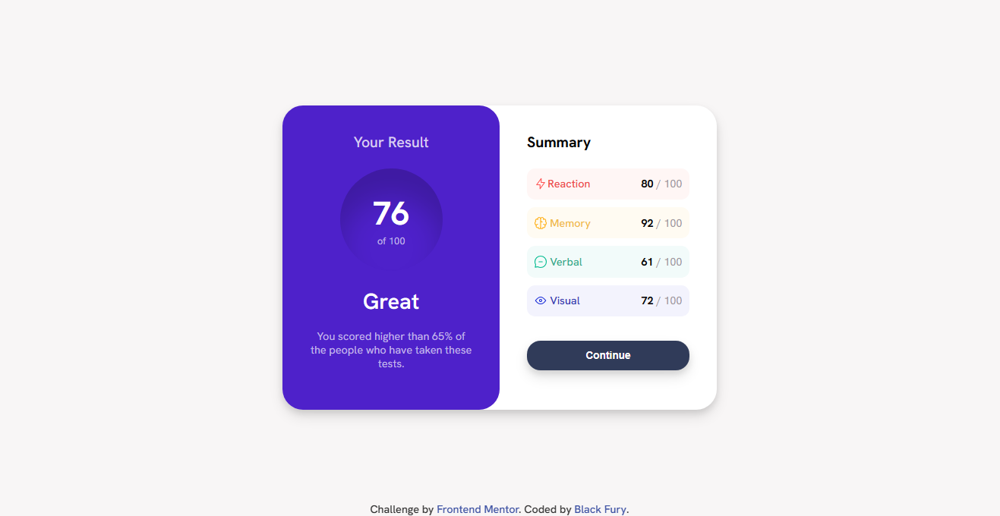

# Frontend Mentor Challenge | Results-summary-component

This is the solution to the [Results summary component challenge on Frontend Mentor](https://www.frontendmentor.io/solutions/responsive-results-component-using-html-css-and-some-javascript-OK01CqbnrU). Frontend Mentor challenges help us to improve our coding skills by building realistic projects.   

## Built with

- Semantic HTML5 markup
- CSS custom properties
- Flexbox
- CSS Grid
- Mobile-first workflow

Preview it here - [Results summary component](https://blackfury117.github.io/Results-summary-component/)   

## Author

- Website - [Black Fury](https://blackfury117.github.io/)
- Frontend Mentor - [@BlackFury117](https://www.frontendmentor.io/profile/BlackFury117)
- Twitter - [@blackfury117](https://twitter.com/blackfury117)
